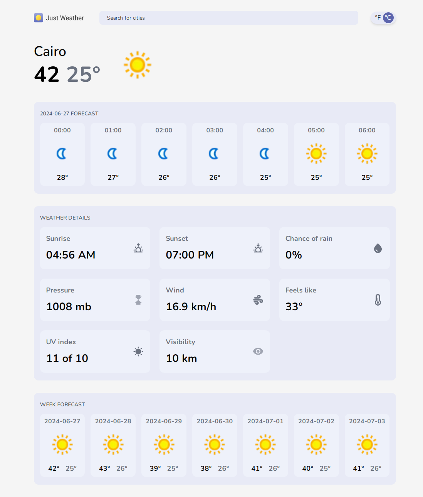

# Just Weather
This is a weather web app built with React and Vite that allows users to search for a city and get the weather conditions for this city.



## Features:
- Search for weather information by city name.
- View a 7-day forecast for the selected location.
- View weather details including temperature (Celsius or Fahrenheit), humidity, wind speed, chance of rain, UV index, and more.

## Tech Stack:
- React.js
- Vite
- Tailwindcss
- React-Query
- Vitest
- Swiper JS
- Day.js

## Installation:
To run this application locally, you'll need to have Node.js and npm istalled. Once you have clonde this repository, navigate to the project directory and run the following commands:
```
npm install
```
```
npm run dev
```
This will install the necessary dependencies and start a local development server.

## Demo:
Live Demo URL: (https://justweather-app.netlify.app)

## API Used:
Free Weather API: (https://www.weatherapi.com)
